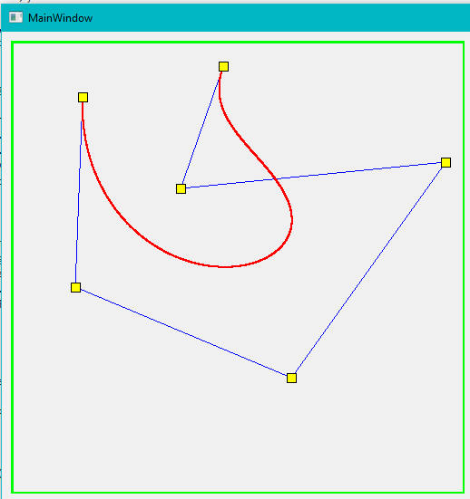
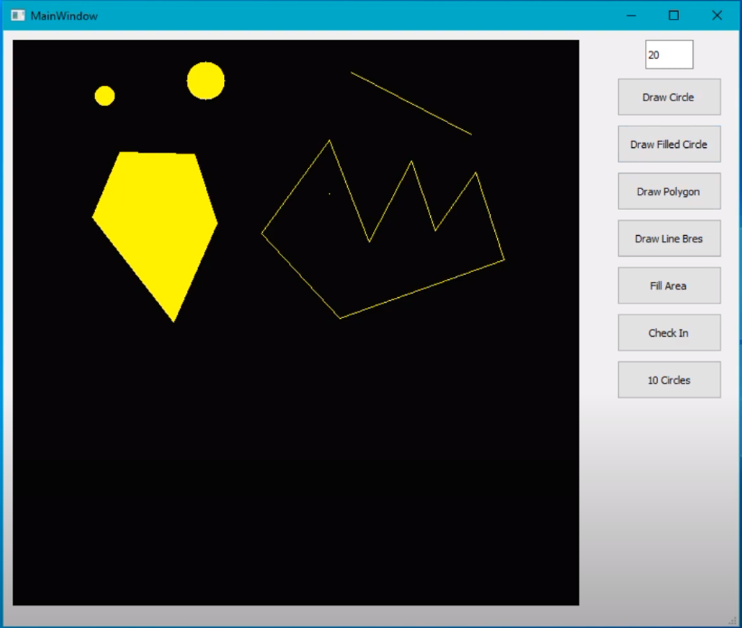

# Computer-Graphic-Algorithms
- This repo create for understand computer graphics algorithms. 
- Visualized with form application in QT.
- You can watch my [you tube video](https://youtu.be/8Ahxtv73bPE) for understand how this project work.

# Project Content
- Bézier curve algorithm
- Line Bresenham algorithm
- Draw circle 
- Draw filled circle
- Draw polygon
- Fill area

# Project View

